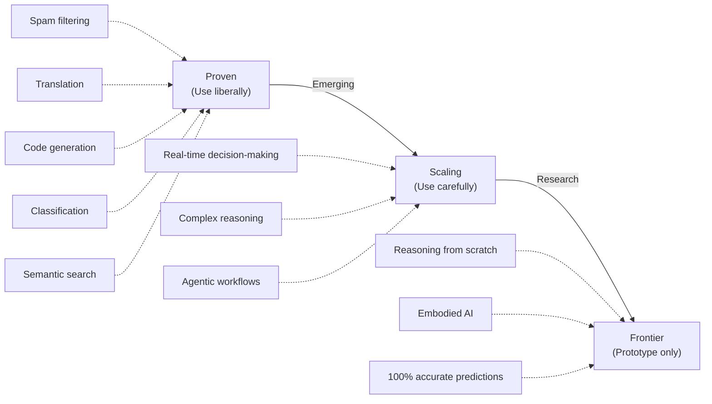

Not every problem is an AI problem. Your job as a PM is to recognize where AI creates real value versus where it's hype. This module teaches you to think strategically about WHERE AI belongs in your product—and critically, where it doesn't.

## The Core Insight: Not All Opportunities Are Equal

Imagine you're an engineer tasked with "improving something." You could optimize code, add caching, rewrite in a faster language. Each approach is valid for different problems. The same logic applies to AI.

AI is a tool that excels at specific problem types. Before you evangelize your company's "AI strategy," you need to develop pattern recognition: **Can we solve this better with AI, or is this a case of hammer-seeking-nails?**

This matters because:
- **Resource cost**: Building AI features is expensive (data annotation, compute, testing, ongoing maintenance)
- **Risk profile**: AI introduces non-determinism; some products cannot tolerate that
- **Competitive advantage**: AI provides value where it solves a problem humans or rules-based systems struggle with
- **User expectations**: AI features require different UX, data governance, and transparency approaches

Your strategic task is ruthlessly honest evaluation: Does AI make this better, cheaper, faster, or more delightful?

---

## Where AI Excels TODAY

These domains have proven, reliable AI solutions deployed at scale. If your opportunity maps to one of these, you're on solid ground.

### Text Generation & Summarization

**The capability**: Take input text and produce human-readable output. This includes emails, product descriptions, social media captions, documentation, summaries of long documents.

**Why it works**: Large language models (LLMs) have absorbed patterns from billions of text examples. They're exceptionally good at the structure and fluency of language.

**Real-world examples**:
- **Slack** uses AI to summarize threads, cutting through noise
- **HubSpot** generates email templates and subject lines
- **Notion** auto-completes documentation
- **GitHub Copilot** writes code comments and docstrings

**PM consideration**: This is safe territory. The downside of "slightly awkward phrasing" is low. Users expect imperfection and can edit. This is often the first AI feature companies ship.

### Classification & Tagging

**The capability**: Assign a label or category to text, images, or user behavior. Examples: Is this email spam? Sentiment (positive/negative/neutral)? Is this support ticket urgent or routine?

**Why it works**: Classification is a bounded problem. There are a finite set of valid outputs, and AI learns to recognize patterns in inputs that predict them.

**Real-world examples**:
- **Gmail** filters spam with high accuracy
- **Zendesk** routes support tickets to the right queue
- **Stripe** flags fraudulent transactions
- **LinkedIn** classifies content quality for feed ranking

**PM consideration**: Classification is mature and reliable. The key risk is edge cases (ambiguous tickets that could be two categories). Build in human review for low-confidence predictions or high-stakes decisions.

### Semantic Search & Retrieval

**The capability & why it works**: Modern embeddings capture semantic similarity far better than keyword matching, enabling context-aware search—**Notion** search understands intent and **GitHub** finds similar code functions naturally.

**PM consideration**: This wins quiet credibility immediately; users notice it's smarter than keyword search. Lower risk than generation because you're always retrieving something that exists.

### Translation & Multilingual Support

**The capability & why it works**: Neural machine translation has reached human parity for many language pairs and is dramatically better than rule-based approaches—**YouTube** auto-generates captions in roughly a dozen major languages and auto-translates them to 100+ more, while **Stripe** localizes docs for global developers using similar capabilities.

**PM consideration**: Translation is reliable for major languages (English, Spanish, Mandarin, etc.); rare language pairs are weaker. This is table-stakes for global products.

### Code Generation & Technical Documentation

**The capability**: Write code, debug code, generate documentation, or write technical explanations.

**Why it works**: LLMs have ingested massive amounts of open-source code and technical writing. They pattern-match on programming concepts.

**Real-world examples**:
- **GitHub Copilot** generates code suggestions (adopted by millions of developers)
- **Cursor** (AI-native code editor) accelerates development
- **Codeium** generates function implementations
- **Mintlify** auto-generates API documentation

**PM consideration**: Code generation is probabilistic—it produces plausible-sounding code that may not be correct. It's a powerful *accelerant* for developers, not a replacement. The PM value is: faster development cycles, reduced boilerplate work, and enabling junior engineers.

### Image Recognition & Analysis

**The capability & why it works**: Computer vision has matured significantly and can recognize thousands of objects and patterns—**Stripe** extracts card details from photos and **Figma** auto-generates alt-text with high reliability.

**PM consideration**: Vision is most reliable for common objects and patterns; it struggles with artistic interpretation or edge cases. Always provide a manual override path.

---

## Where AI Is Emerging (Unproven at Scale)

These areas are advancing rapidly but haven't reached production reliability for most use cases. Invest cautiously; you may become a beta tester for the broader industry.

### Complex Reasoning & Multi-Step Logic

**The capability**: Solve problems that require breaking down steps, checking logic, adjusting based on feedback, or reasoning across domains.

**Current state**: Large models are improving at chain-of-thought reasoning, but they're inconsistent. They work well on homework problems, but struggle with novel, complex reasoning.

**Examples of attempts**:
- AI financial advisors (still require human oversight)
- AI legal review (catches some issues, misses others)
- Complex data analysis requiring multiple transforms

**PM consideration**: If you need reliable multi-step reasoning, you're still in hybrid territory: AI handles parts, humans handle verification. Pure AI for complex reasoning is not yet production-grade.

### Real-Time Decision-Making

**The capability**: Make split-second decisions in live systems (trading, autonomous vehicles, real-time pricing).

**Current state**: Real-time AI works if decisions are pre-computed and cached (like price optimization), but live inference at scale is still expensive and latency-sensitive.

**Examples of attempts**:
- Real-time fraud detection (hybrid: rules + model scoring)
- Autonomous vehicle navigation (still heavily engineered, not pure learning)
- High-frequency trading (deterministic algorithms are faster)

**PM consideration**: This is hardware and latency-constrained. Real-time AI is possible, but you're battling physics. Most "real-time" AI products are actually "fast batch" (decisions made seconds before, not milliseconds).

### Creative Work & Novel Generation

**The capability**: Generate truly novel creative outputs (music, art, novel writing) that didn't exist before and are genuinely original.

**Current state**: Generative models (DALL-E, Midjourney, Suno) produce impressive output, but they remix patterns from training data rather than create fundamentally novel things. Humans notice the remixing.

**Examples of attempts**:
- AI music composition (sounds good but recognizably pattern-based)
- AI novel writing (entertaining but predictable)
- AI art generation (amazing visuals but derivative)

**PM consideration**: This is a UX category that users should know is AI-generated. The value is in acceleration and inspiration, not replacement of human creativity. Also watch the legal space—copyright of training data is unsettled.

---

## Where AI Still Struggles (Current Limitations)

Know where to avoid. These areas consistently fail or deliver poor ROI.

### Precise Arithmetic & Financial Calculations

**The problem**: LLMs are trained on text, not math. They frequently "hallucinate" wrong answers that *sound* plausible.

**Why it fails**: "What is 2747 x 368?" Expect wrong answers from raw LLMs.

**Example**: Banks don't use raw AI for interest calculations. Ever.

**PM consideration**: **Do not ship raw AI for financial math.** Pair AI with deterministic calculation engines, or don't use AI.

### Perfect Accuracy Tasks

**The problem**: AI is probabilistic. It makes mistakes. These mistakes are often confident-sounding.

**Tasks to avoid**:
- Medical diagnosis (requires 99.9%+ accuracy; AI isn't there)
- Compliance & legal interpretation (wrong answer = lawsuit)
- Safety-critical systems (autonomous vehicles need near-perfect, not 95%)

**PM consideration**: AI can *assist* these domains (helping doctors flag cases, assisting lawyers in research), but not replace human judgment.

### Real-Time Data Integration

**The problem**: AI models are snapshots in time. They need retraining or fine-tuning to incorporate new data. They're slow to adapt.

**Examples**:
- Stock prices (change continuously)
- Social feeds (need to be current)
- Inventory systems (data changes second-by-second)

**PM consideration**: If your product requires real-time data, AI is better used for insights or batch processing, not live decision-making.

### Tasks Requiring Specialized Domain Knowledge

**The problem**: LLMs have broad knowledge but shallow expertise. They don't know your company's proprietary systems, your customer data, or your business rules.

**Real example**: You ask GPT-4 a question about your internal API. It makes a plausible but wrong guess because it's never seen your code.

**PM consideration**: AI works best when augmented with your data (retrieval-augmented generation, or RAG). Raw AI on specialized domains often fails.

---

## The Critical Framework: Deterministic vs. Probabilistic

This is the single most important concept for PM decision-making around AI. It determines whether AI is appropriate for your use case.

### Deterministic Systems

**Definition**: Same input always produces the same output. No randomness.

**Examples**:
- Calculating interest = `(principal x rate x time) / 100`
- Sorting a list of names alphabetically
- Authorizing a payment (rules engine: "check account balance, verify PIN, approve or deny")

**Characteristics**:
- Predictable and reliable
- Easy to debug (if X happens, Y always follows)
- Safe for critical operations
- Limits adaptability (changing the rule requires code changes)

### Probabilistic Systems

**Definition**: Same input may produce different outputs. Decisions are based on statistical patterns, not fixed rules.

**Examples**:
- Recommending a product ("users like you bought this")
- Ranking search results ("this is probably what you're looking for")
- Classifying sentiment ("this review sounds negative")
- Generating text ("here's a plausible next sentence")

**Characteristics**:
- Adaptive (learns from new data)
- Powerful for prediction and pattern recognition
- Inherently uncertain (always some error rate)
- Harder to debug ("why did it recommend *that*?")

### The Decision Matrix

The question you must ask: **Is this task inherently probabilistic, or am I forcing probabilism where determinism works?**

| Task Type | Best Approach | Why |
|-----------|---------------|-----|
| Banking transaction | Deterministic | Customers need 100% certainty. Rules-based systems are reliable. AI adds risk. |
| Recommending a movie | Probabilistic | No single "correct" answer. AI learns from behavior patterns. |
| Spam filtering | Probabilistic | Some borderline cases exist. AI's "best guess" is valuable. |
| Calculating tax | Deterministic | Legal requirement for precision. Use math, not learned patterns. |
| Detecting fraud | Hybrid | Deterministic rules (impossible transactions) + probabilistic scoring (anomaly detection). |
| Personalizing content | Probabilistic | Users appreciate variety. AI's probabilistic ranking provides it. |

### Real-World Example: Meta's Ad System

Meta's ad system blends both brilliantly:

1. **Advertiser input** (deterministic): Budget, targeting criteria, creative assets
2. **User data** (deterministic): Age, location, interests
3. **Probabilistic model**: "What's the likelihood this user clicks this ad?" (learned from billions of impressions)
4. **Deterministic rules**: "Show ads to users ranked by predicted click-through, respecting budget caps"

The result: AI drives the prediction, but deterministic rules ensure budget constraints and business logic are honored.

### Why This Matters for PM

Before you green-light an AI feature, ask:
- **Is this a probabilistic problem by nature?** (recommendations, translation, classification) → AI is appropriate
- **Am I trying to make a deterministic problem probabilistic?** (financial calc, yes/no decisions) → Use rules or deterministic systems instead
- **Is this hybrid?** (AI prediction + deterministic enforcement) → This is often the sweet spot

---

## Common AI Use Cases Taxonomy

Here's a practical framework for spotting AI opportunities in your product. These use cases have proven ROI across industries.

### Customer Experience & Support

| Use Case | AI Technique | Maturity | Risk | ROI |
|----------|--------------|----------|------|-----|
| Chatbot for FAQs | Classification + retrieval | Proven | Low | High |
| Ticket routing | Classification | Proven | Low | High |
| Agent assist (summaries) | Summarization | Proven | Low | High |
| Sentiment analysis | Classification | Proven | Low | Medium |
| Predictive churn | Regression/classification | Proven | Low | High |
| Personalized help articles | Semantic search | Emerging | Low | Medium |

### Content & Knowledge Management

| Use Case | AI Technique | Maturity | Risk | ROI |
|----------|--------------|----------|------|-----|
| Auto-summarization | Summarization | Proven | Low | High |
| Smart tagging | Classification | Proven | Low | Medium |
| Search | Semantic search | Emerging | Low | High |
| Content generation | Text generation | Proven | Medium | High |
| Duplicate detection | Similarity matching | Proven | Low | Medium |

### Sales & Marketing

| Use Case | AI Technique | Maturity | Risk | ROI |
|----------|--------------|----------|------|-----|
| Lead scoring | Regression/classification | Proven | Low | High |
| Email subject lines | Text generation | Proven | Medium | High |
| Product recommendations | Collaborative filtering | Proven | Low | High |
| Sales forecasting | Time series forecasting | Proven | Medium | Medium |
| Prospecting lists | Classification/ranking | Emerging | Medium | Medium |

### Operations & Finance

| Use Case | AI Technique | Maturity | Risk | ROI |
|----------|--------------|----------|------|-----|
| Expense categorization | Classification | Proven | Low | Medium |
| Fraud detection | Anomaly detection | Proven | Low | High |
| Data extraction | OCR + classification | Proven | Low | Medium |
| Predictive maintenance | Time series forecasting | Emerging | Medium | Medium |
| Invoice processing | OCR + extraction | Proven | Low | High |

### Product Development

| Use Case | AI Technique | Maturity | Risk | ROI |
|----------|--------------|----------|------|-----|
| Code generation | Text generation | Proven | Medium | High |
| Documentation writing | Summarization + generation | Proven | Low | Medium |
| Bug triage | Classification | Emerging | Medium | Medium |
| Test case generation | Code generation | Emerging | Medium | Medium |

---

## The AI Opportunity Spotting Checklist

Use this to evaluate your backlog items and feature requests. Start with the five-question quick filter. If you answer "yes" to at least three, move to the detailed assessment below.

### Quick Filter (Ask These First)

1. Is this task **repetitive** and happening at **high volume**?
2. Does it involve **processing unstructured data** (text, images, audio)?
3. Can users **tolerate imperfect results** (or is there a human review step)?
4. Do you have **accessible data** to test and evaluate against?
5. Would solving this create **measurable business value** (time saved, revenue, cost reduction)?

Three or more "yes"? This is likely worth deeper investigation.

### Detailed Assessment

**Problem Assessment.** Start by asking whether this is genuinely high-friction — does it waste meaningful customer or employee time? The strongest AI opportunities are repetitive tasks happening at high volume (thousands of times), involve prediction (assigning labels, scores, or rankings) or generation (creating content like text, code, or images), and deal with unstructured data like text, images, or user behavior where AI has a natural advantage over rule-based systems.

**Feasibility Assessment.** Does the opportunity have a solid foundation? You'll need accessible data—thousands of labeled examples minimum—to train and validate any model, and those examples must be representative of real-world scenarios. Establish what the current human or rule-based approach costs, what success metrics look like (accuracy, latency, user satisfaction), and whether you can scope an MVP that captures 80% of the value in the first iteration. The question is never "can we build this perfectly," but "can we build this now and improve it in production?"

**Risk Assessment.** Honestly evaluate what could go wrong. Does the task genuinely require perfect accuracy (medical diagnosis, compliance decisions), or can it tolerate imperfect results with human review? Are there legal or compliance implications that require explainability—can you justify a decision to a regulator or customer? Is this safety-critical? Do users need to trust the recommendation, or will they verify it? How will the system degrade gracefully when it's uncertain? These questions determine whether your project is high-risk or manageable.

**Strategic Assessment.** Finally, ask whether this actually moves the business. Is this a core competitive advantage or a nice-to-have? Can you iterate quickly on a real feature with real users, or are you stuck in proof-of-concept mode? Will it improve retention, reduce support costs, or increase customer lifetime value? If you're building an AI feature that doesn't improve any meaningful business metric, you're likely solving the wrong problem.

**Red Flags — Do Not Proceed Without Strong Justification.** Before you commit resources, check for these warning signs: the task requires 99%+ accuracy and you plan to ship without human review; you don't have labeled data and can't realistically create it; you're using raw AI for financial calculations or legal decisions; you can't explain why the AI made a specific decision to a customer or regulator; this "feels" like an AI problem but doesn't solve a real customer pain point; or competitors have vastly superior solutions and you're years behind. Any of these should trigger a step back.

---

## Mental Model: The AI Maturity Curve

Different AI techniques have different maturity levels. Choose based on your appetite for risk.

**Proven**: These have been shipping at scale for 3+ years. Start here. Risk of failure is low; risk of suboptimal results is higher.

**Scaling**: These are gaining adoption but still encountering novel edge cases. Expect to spend time on customization and fine-tuning.

**Frontier**: These are research-grade. Ship only if you have high risk tolerance and strong technical expertise. Expect the broader industry to catch up soon.

---

## Antipattern: "We Should Add AI"

Finally, watch out for the most common PM mistake: reverse-engineering reasons to use AI.

**Bad thinking**:
- "AI is hot, so let's find a problem for it"
- "Our competitor announced an AI feature, so we need one too"
- "Our CEO read about LLMs; let's use one"

**Good thinking**:
- "We spend millions on customer support; AI for intelligent routing could save 20%"
- "Our users struggle to find documents; semantic search would reduce support tickets"
- "Generating product descriptions takes our team 40 hours/week; AI could cut that to 10"

AI is a tool. Use it to solve real problems, not to be fashionable.

---

## Key Takeaways

1. **Not every problem is an AI problem.** Your job is to find the RIGHT ones—where AI creates measurable value.

2. **AI excels at certain tasks today**: text generation, classification, semantic search, translation, code generation, and image recognition. Start here.

3. **Some areas are emerging**: complex reasoning, real-time decision-making, creative work. These are higher-risk; prototype, don't ship.

4. **AI struggles with**: precise arithmetic, perfect accuracy tasks, real-time data, and tasks requiring specialized domain knowledge. Avoid or use with caution.

5. **Deterministic vs. probabilistic is critical.** Use probabilistic AI for problems that are inherently probabilistic (predictions, recommendations). Don't force AI into deterministic problems (financial calculations, yes/no rules).

6. **Use the opportunity spotting checklist** to evaluate features: Problem friction, data availability, success metrics, risk profile, and strategic impact.

7. **Maturity matters.** Proven techniques are safe; emerging ones require more expertise; frontier research should stay in the lab.

---

## Explore Further

- LLMs — Deep dive into how large language models work
- Prompt Engineering — Techniques to get better outputs from AI
- Assessing AI Viability — Evaluate whether an AI opportunity is worth pursuing
- Opportunity Exercise — Hands-on exercise to map workflows and identify AI opportunities
- Design AI Features — Design patterns, model selection, and failure case planning
