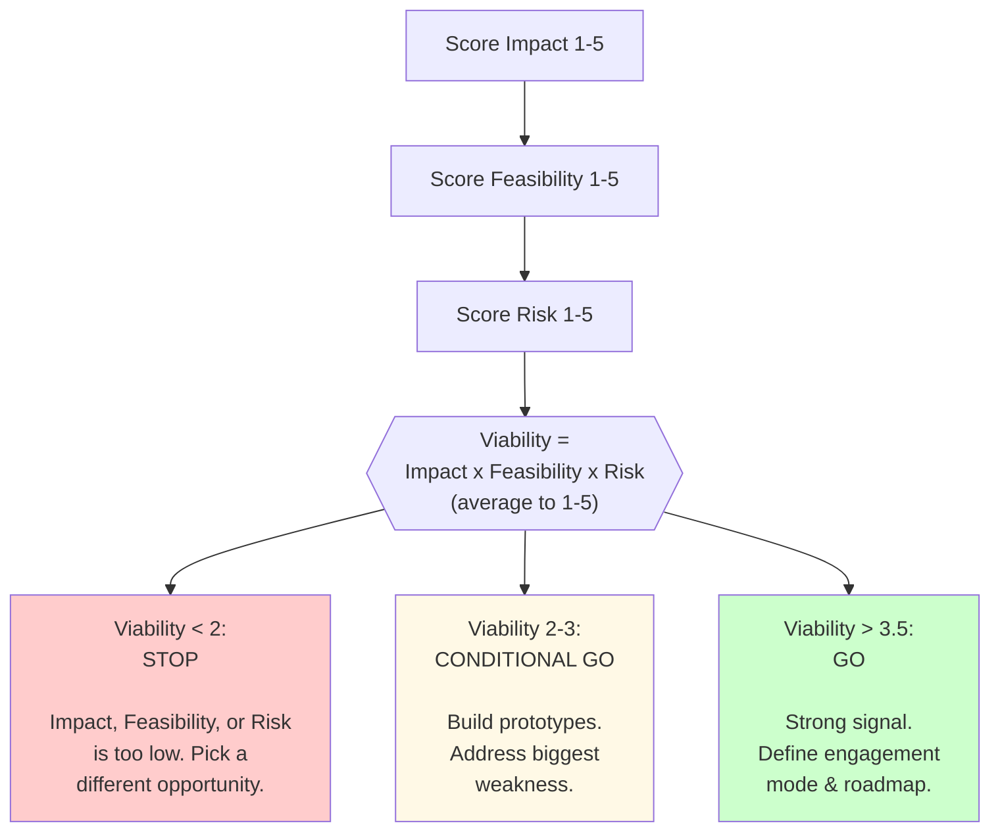
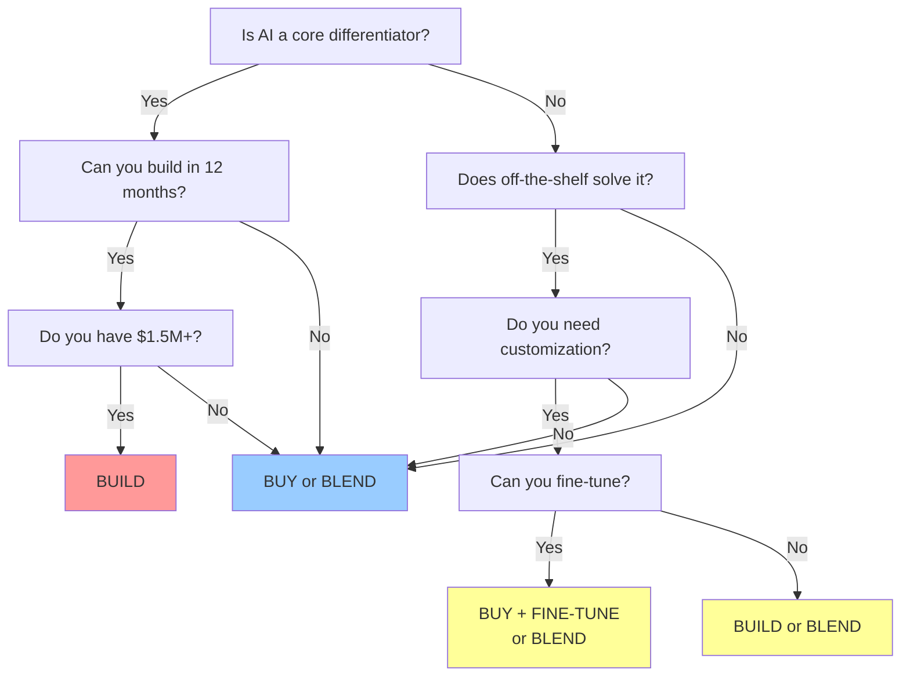
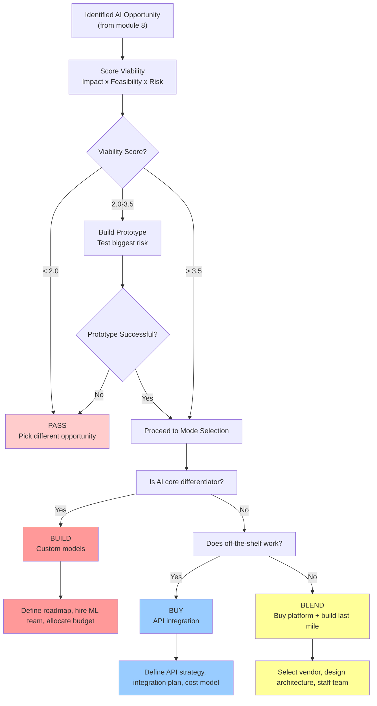

## The Hard Part Comes Now

Finding an AI opportunity is step one. Most teams can do that—there's a use case hiding everywhere. Assessing whether to *actually pursue it* is where product managers earn their salary.

You've identified a problem that AI might solve. Maybe it's automating customer support, personalizing recommendations, or surfacing insights from unstructured data. But not every AI opportunity is worth pursuing. Some require data you don't have. Others carry risks that outweigh the upside. Still others can be solved cheaper and faster with a simpler approach.

This module walks you through a systematic way to evaluate whether an AI opportunity is viable—and if it is, how to decide whether to build it, buy it, or partner for it.

---

## Part 1: Modes of Engaging with AI

AI isn't binary. You don't simply choose "build" or "not build." There's a spectrum of engagement modes, each with different tradeoffs around speed, control, cost, and risk.

### The AI Engagement Spectrum

#### Mode 1: Off-the-Shelf AI Products
Use ChatGPT, Claude, Copilot, or other consumer or enterprise AI products directly.

**When to use:**
- You're experimenting fast and cheap
- The use case is generic (writing, summarization, Q&A)
- You need zero integration with your systems
- Users can tolerate vendor lock-in

**Tradeoffs:**
- Fastest time-to-value
- Zero data ownership or privacy guarantees (watch what you share)
- No customization; everyone gets the same model
- Vendor controls pricing and features; can't scale predictably

**Example:** A PMO office uses ChatGPT to generate meeting agendas and status templates.

#### Mode 2: Integration via API
Embed pre-trained models from OpenAI, Anthropic (Claude), Google (Gemini), or others via their APIs.

**When to use:**
- You need AI embedded in your product
- Speed-to-market matters; you can't wait months to build
- The use case is common enough that off-the-shelf works
- You want some control over the interface but not the model

**Tradeoffs:**
- Faster than building models; weeks instead of months
- Your data stays in your systems (mostly)
- Model capabilities are fixed; no customization
- Pay per API call; costs grow with usage (but predictable)
- Depends on vendor uptime and rate limits

**Example:** A recruitment SaaS embeds OpenAI's API to auto-generate job descriptions from rough notes.

#### Mode 3: Fine-Tune Existing Models
Take a pre-trained model (e.g., OpenAI's GPT, Claude) and fine-tune it on *your* data to specialize it for your domain.

**When to use:**
- Your use case is domain-specific (legal, medical, finance)
- You have enough high-quality examples to train on (hundreds to thousands)
- You need better accuracy than a generic model
- You want the model to "speak" your language or follow your style

**Tradeoffs:**
- Moderate time-to-value; weeks to months to collect and label data
- Better accuracy than generic models
- Still depends on vendor infrastructure
- Can be costly if you fine-tune often or on large models
- Your training data may be used to improve the vendor's model (check terms)

**Example:** A healthcare startup fine-tunes Claude on its medical records to generate clinical summaries tailored to your EHR workflows.

#### Mode 4: Train Custom Models from Scratch
Hire machine learning engineers to build a model from the ground up using your data and infrastructure.

**When to use:**
- AI is a core competitive advantage (think Google's search ranking, Netflix's recommendations)
- You have proprietary data that gives you an unfair advantage
- You need extreme control over latency, privacy, or inference costs
- Off-the-shelf models actively harm your business (competitor visibility, quality)

**Tradeoffs:**
- Months to years to build; high upfront R&D cost
- Ongoing maintenance, retraining, and infrastructure costs (often 2-3x build cost)
- Full control and ownership; no vendor lock-in
- Requires world-class ML talent (expensive, scarce)
- Only worth it if AI is genuinely core to your product

**Example:** Spotify builds custom recommendation models on billions of user interactions—generic models can't compete.

### Decision Framework: Which Mode Should You Choose?

Ask these questions in order:

1. **Is speed critical?** If you need to ship in weeks, Mode 2 (API). If you need it in days, Mode 1.
2. **Is this your competitive moat?** If yes, Mode 4 (custom). If no, continue.
3. **Do you have specialized domain data?** If yes and you have budget, Mode 3 (fine-tune). If no, Mode 2.
4. **Can off-the-shelf work for your accuracy bar?** If yes, Mode 1 or 2. If no, Mode 3 or 4.

Reality check: Most healthy companies live in Mode 1-2, with Mode 3 for specific use cases, and Mode 4 only when they're Google, Netflix, or Tesla.

---

## Part 2: AI Risks You Must Evaluate

Every AI opportunity carries risk. As a PM, it's your job to name them, quantify them, and decide if they're acceptable.

### The Risk Landscape

| Risk Category | What It Is | Why It Matters | Example |
|---|---|---|---|
| **Hallucination & Accuracy** | Model generates false, misleading, or outdated information | Wrong answer in a critical domain (medical, legal, finance) can cause real harm. Users lose trust. | LLM hallucinating a legal precedent that doesn't exist in a contract review tool |
| **Data Privacy & Security** | Your user data or training data leaks, is misused, or is exposed to unauthorized parties | GDPR, HIPAA, SOX violations. Loss of customer trust. Regulatory fines. | Customer data sent to OpenAI API without explicit consent (check your data processing agreements) |
| **Bias & Fairness** | Model systematically underperforms for certain groups or makes unfair decisions | Hiring discrimination. Lending discrimination. Unequal user experience. Legal liability. | Resume screening tool rates women 20% lower than men for equivalent experience |
| **Regulatory & Compliance** | New AI-specific regulations (EU AI Act, AI Bill of Rights proposals, industry-specific rules) impose requirements you can't meet | EU AI Act fines up to EUR 35 million or 7% of global revenue for high-risk AI | Using an unaudited LLM in a bank to make lending decisions without documentation |
| **Vendor Lock-In & Dependency** | You become dependent on a single vendor's API, pricing, or roadmap | Vendor raises prices, deprecates features, shuts down, or pivots. You're forced to rebuild. | Building your entire product on OpenAI API v1, then having to rewrite when they sunset it |
| **Cost Unpredictability** | AI inference, training, or fine-tuning costs balloon faster than you forecasted | A viral feature causes 10x inference costs overnight. Model training takes longer than expected. | Launched an AI-powered feature that unexpectedly went viral; monthly API bills jumped from $5k to $50k |
| **User Trust & Adoption Risk** | Users distrust AI, don't understand how it works, or feel it's replacing them | Adoption stalls. Negative sentiment. Attrition, especially if AI makes mistakes. | Customer support team fears the AI chatbot will replace them; they hide it from customers |

### Where AI Risks Show Up

**During training/fine-tuning:**
- Do you have enough clean, representative data?
- Are you accidentally encoding historical bias?
- Can you afford the compute cost to train and iterate?

**During inference:**
- Will the model hallucinate in ways that matter?
- Can you verify the model's output before it reaches users?
- What's your latency requirement, and can the model meet it?

**In deployment:**
- Do users trust the AI? Can you explain how it works?
- Does the model degrade in production on out-of-distribution data?
- Can you monitor it, detect drift, and roll back if it breaks?

**Post-launch:**
- How do you monitor for bias over time?
- What happens if a regulatory change makes your use case illegal?
- Can you switch vendors or models without rebuilding the product?

---

## Part 3: The Viability Evaluation Framework

Use this framework to score any AI opportunity. It combines three dimensions: **Impact**, **Feasibility**, and **Risk**. This mirrors the classic **Desirability, Viability, Feasibility (DVF)** framework used in product innovation, adapted for AI.

### Dimension 1: Impact (Desirability)

Does solving this problem matter? Impact has two parts: user value and business value.

**User Value:**
- How much does this reduce friction or create new capability?
- How often will users encounter this feature?
- Would users choose your product over a competitor because of this?

Score 1-5:
- 1 = Nice-to-have; users will live without it
- 3 = Solves a real problem; users will appreciate it
- 5 = Must-have; directly addresses a top-3 user need

**Business Value:**
- How does this tie to revenue (upsell, retention, CAC reduction)?
- How much operational cost does it save?
- What's the addressable market?

Score 1-5:
- 1 = Unrelated to business metrics
- 3 = Modest revenue or cost impact
- 5 = Direct path to >5% revenue uplift or >10% cost reduction

**Impact Score = (User Value + Business Value) / 2**

### Dimension 2: Feasibility

Can you actually build this with your constraints?

**Data Availability:**
- Do you have clean, labeled data in sufficient volume (100s to 1000s of examples, depending on task)?
- Can you get more data if the first attempt fails?
- Is your data representative of real-world cases?

Score 1-5:
- 1 = No labeled data; would take months to collect
- 3 = You have some data, but it's messy or incomplete
- 5 = Clean, labeled dataset already in hand; easy to update

**Technical Complexity:**
- Is this a solved problem (text classification, sentiment analysis, Q&A on documents)?
- Or is it novel and risky (real-time video analysis, multi-step reasoning)?
- Can a standard API or fine-tuned model do it, or do you need custom R&D?

Score 1-5:
- 1 = Requires novel research; no clear solution path
- 3 = Standard approach exists; some uncertainty
- 5 = Off-the-shelf solution exists; minimal engineering

**Team Capability:**
- Do you have ML engineers? How senior?
- Can your team own this end-to-end, or do you need to hire?
- Do you have product sense for AI products (how to evaluate, monitor, iterate)?

Score 1-5:
- 1 = No AI expertise; major hiring needed
- 3 = Moderate capability; can build with some consulting
- 5 = Strong ML and product AI expertise in-house

**Feasibility Score = (Data + Complexity + Team) / 3**

### Dimension 3: Risk

What can go wrong, and how much does it cost if it does?

For each risk category below, score 1-5 where 1 = high risk, 5 = low risk.

**Accuracy Risk:**
- How much must the model be right? (e.g., resume screening vs. typo detection)
- What happens if it's wrong 5% of the time? 10%?
- Can you have a human-in-the-loop fallback?

Score 1-5:
- 1 = Model must be >99% accurate; any error is costly; no fallback
- 3 = Model should be 90%+ accurate; occasional errors are recoverable
- 5 = Accuracy is nice-to-have; users can tolerate errors

**Data Privacy Risk:**
- Will you send customer data to an external API or vendor?
- Are you storing sensitive data (PII, health info, financial data)?
- What compliance regs apply (GDPR, HIPAA, CCPA)?

Score 1-5:
- 1 = Handling sensitive data; regulatory exposure; no DPA in place
- 3 = Some PII; vendor has compliance certifications
- 5 = No sensitive data; or robust privacy controls in place

**Bias & Fairness Risk:**
- Are you making or influencing high-stakes decisions (hiring, lending, diagnosis)?
- Do you have diverse training data?
- Can you audit for disparate impact?

Score 1-5:
- 1 = High-stakes decisions; training data is non-representative; no audit plan
- 3 = Medium-stakes decisions; training data is mostly diverse; audit planned
- 5 = Low-stakes decisions; training data is representative; audited

**Vendor Lock-In Risk:**
- Are you building on an API from a single vendor?
- How easy is it to switch to another model or vendor?
- What's your exit strategy if the vendor changes direction?

Score 1-5:
- 1 = Fully dependent on one vendor; expensive to switch
- 3 = Moderate dependency; could switch in weeks
- 5 = Open, portable architecture; can swap models easily

**Cost Predictability Risk:**
- Can you forecast inference costs for the next 12 months?
- How sensitive is cost to usage growth?
- Are there per-call limits or surprise charges?

Score 1-5:
- 1 = Unpredictable; per-call pricing; potential surprise costs
- 3 = Mostly predictable; some variable costs
- 5 = Fixed costs or fixed-per-unit costs; fully predictable

**Trust & Adoption Risk:**
- Will users accept AI-driven outcomes?
- Can you explain how the AI works in plain language?
- Are there internal concerns (e.g., will this displace employees)?

Score 1-5:
- 1 = Low trust in AI; hard to explain; internal resistance
- 3 = Neutral stance; explainability moderate
- 5 = High trust; easy to explain; internal buy-in

**Risk Score = Average of all 6 risk dimensions**
(Higher score = lower risk, which is good.)

### Putting It Together: The Viability Matrix

**Interpretation:**

- **Viability < 2.0:** Stop. One dimension is badly broken. Don't invest time here; pick a different opportunity.
- **Viability 2.0-3.5:** Conditional go. Build a prototype to test your biggest risk (usually feasibility or accuracy). Use the prototype to raise your score before committing.
- **Viability > 3.5:** Green light. You have strong signals. Define your engagement mode (API, fine-tune, custom?) and ship.

**Real Example:**

You're considering AI-powered personalized email subject lines.

| Dimension | Subscore | Reasoning |
|---|---|---|
| User Value | 3 | Users open more emails if subject lines are better, but it's not the #1 complaint. |
| Business Value | 4 | 10% improvement in open rate = 5% revenue uplift. |
| **Impact** | **3.5** | Solid business case. |
| Data Availability | 4 | You have 2 years of email open/click data, segmented by user. Easy to label. |
| Technical Complexity | 5 | This is a solved problem; GPT-4 can do it easily. |
| Team Capability | 4 | Your team has built with APIs before. |
| **Feasibility** | **4.3** | Very feasible. |
| Accuracy Risk | 4 | Occasional weird subject lines are fine; users just ignore them. |
| Privacy Risk | 5 | You're not exposing PII; subject line is already public. |
| Bias Risk | 5 | No high-stakes decisions; low harm from bias. |
| Vendor Lock-In | 4 | You're using OpenAI API; could switch to Anthropic in a week. |
| Cost Risk | 4 | Per-email cost is <$0.001; predictable. |
| Trust Risk | 5 | It's a suggestion tool; users see the AI is helping. |
| **Risk** | **4.5** | Low risk overall. |
| **Overall Viability** | **4.1** | **Strong GO.** Ship with Mode 2 (API integration). |

---

## Part 4: The Build vs. Buy Decision

Once you've decided an AI opportunity is viable, the next decision is *how* to build it. Should you use an off-the-shelf tool, integrate an API, fine-tune a model, or build custom?

This overlaps with the engagement modes above, but here we're specifically comparing total cost of ownership and control.

### Build: When to Invest

**Build custom models when:**
1. **AI is your core competitive advantage.** Your business model depends on AI being better than competitors. (Spotify recommendations. Tesla autonomous driving. Google Search.)
2. **You have unique data.** You possess proprietary data that off-the-shelf models can't access. Fine-tuning or custom training lets you leverage this advantage.
3. **You need extreme control.** Control over latency (inference must be <100ms), privacy (all data on-premises), cost (millions of inferences/month), or compliance (model decisions must be auditable).
4. **Off-the-shelf doesn't work.** Generic models produce unacceptable results. You've tested APIs, fine-tuning, and none are good enough.

**Real cost of building:**
- Initial development: 6-18 months, 3-8 ML engineers ($600k-$2M)
- Ongoing maintenance: 2-4 engineers, continuous retraining, infrastructure ($400k-$1M/year)
- **Total 3-year cost: $1.8M-$5M+**

Build only if you expect >$5M in value from that advantage.

### Buy: When to Integrate APIs or Use SaaS

**Buy when:**
1. **Speed matters more than customization.** You need to ship in weeks, not months. An API or SaaS product gets you there.
2. **The use case is commoditized.** Generic models (GPT, Claude, Gemini) already solve your problem well. Fine-tuning or custom training adds little value.
3. **You lack AI talent.** You don't have ML engineers, and hiring is expensive/slow. Buy instead of building.
4. **You want vendor-backed compliance.** Enterprise API vendors (OpenAI, Anthropic) provide compliance artifacts (DPAs, audit trails, SOC 2) that reduce your legal/compliance risk.

**Real cost of buying:**
- APIs: $0-$10k/month depending on volume (pay-per-call)
- SaaS: $500-$50k/month depending on vendor and features
- Implementation: 2-8 weeks, 1-2 engineers ($30k-$100k)
- **Total 3-year cost: $200k-$500k**

Buy if you can solve 70%+ of your use case off-the-shelf.

### The Hybrid "Blend" Approach (Current Best Practice)

The real answer for most companies is a **blend**: buy the platform and governance layer, build the last mile.

**Example architecture:**
- **Buy:** OpenAI API or Claude API for core model + OpenAI or Anthropic's platform SDKs for governance, routing, and safety.
- **Build:** Your retrieval pipeline, prompt engineering, domain-specific evaluation datasets, and guardrails.

This gives you:
- Speed: Use a vendor's proven model and safety infrastructure.
- Control: Customize the prompts, retrieval, and evaluation to your domain.
- Cost: Pay per API call; add your own last-mile logic for <$200k.

### The Build vs. Buy Decision Matrix

**Decision rules** (based on current enterprise research):
- **Build if:** AI is a competitive moat AND you have the budget, time, and talent.
- **Buy if:** The use case is commoditized, off-the-shelf works 80%+, or you need to ship fast.
- **Blend if:** You need customization but can't justify building from scratch. Buy the platform, build the last mile.

**Hidden costs to budget for:**
- Fine-tuning: Data labeling ($5k-$100k), model training ($5k-$50k), iteration (6-12 weeks)
- Custom models: Red-teaming and safety validation ($100k-$500k), observability infrastructure ($50k-$200k)
- All modes: Integration engineering, testing, monitoring, support (add 20-50% to stated costs)

---

## Part 5: Putting It All Together

Here's the decision flow from opportunity identification to execution:

### Example: A Fintech PM's Decision

You're a PM at an online lending platform. You want to use AI to auto-score loan applications (predict default risk).

**Step 1: Viability Assessment**
- Impact: 5 (reduces underwriting cost by 30%, speeds approval from 3 days to 2 hours)
- Feasibility: 3 (you have 10 years of loan data, but it's dirty; minimal ML expertise)
- Risk: 1 (regulatory exposure under Fair Lending Act; must audit for bias; accuracy must be >95%; vendor lock-in is dangerous)
- **Viability = 2.3: Conditional go.** Build a prototype to prove the model works and bias audit is feasible.

**Step 2: Prototype & Validation**
- Spend 4 weeks fine-tuning an existing model (Mode 3) on your historical data.
- Validate it reaches 94% accuracy on a holdout set.
- Run a fairness audit; find a 5% disparate impact for women. Iterate.
- After 8 weeks, you've hit 96% accuracy and resolved the bias issue.
- **New viability: 3.8 (go sign).** Risk is now manageable.

**Step 3: Engagement Mode Decision**
- Is auto-scoring a core differentiator? No; all lenders do it.
- Does off-the-shelf work? Partially; generic credit scoring exists but doesn't know your loan book.
- **Decision: BLEND.** Use a fine-tuned model (Mode 3) running on your infrastructure for full control and compliance, but partner with a vendor (e.g., Zest AI) for bias monitoring and audit trails. You keep the model on-premises; they provide governance.

**Step 4: Execution**
- Hire 1 ML engineer to own the fine-tuning and retraining pipeline.
- Build a CI/CD pipeline to retrain monthly and audit for drift.
- Integrate the model into your underwriting engine with a human review step (no pure AI decisions).
- Launch to 10% of applications; monitor for 4 weeks; expand.
- **Timeline: 3 months. Cost: $150k (engineer + infrastructure). Payoff: $500k/year in underwriting savings.**

---

## Key Takeaways

1. **Don't default to "build."** Most companies should live in Modes 1-3 (off-the-shelf, API, fine-tuning). Only Mode 4 (custom models) if AI is truly core to your business.

2. **Use the viability framework.** Score Impact, Feasibility, and Risk. Use it to make go/no-go decisions and to prioritize which risks to address first.

3. **Name your risks explicitly.** The biggest killer of AI projects is ignoring risk until it's too late. Hallucination, privacy, bias, vendor lock-in, cost, and trust are real. Size them early.

4. **"Blend" is the current best practice.** Buy vendor platforms for governance and safety. Build custom last-mile logic for your domain. Get speed, control, and cost all at once.

5. **Prototyping isn't just for validation; it's for learning.** A 4-week prototype will teach you more about feasibility and risk than a 100-slide deck. Use it.

---

## Explore Further

- Identify Opportunities for AI — Where to find AI opportunities in the first place
- Opportunity Exercise — Assess a real AI opportunity using this framework
- Design AI Features — Once you've decided to build, how to deliver it safely and get users to adopt it
