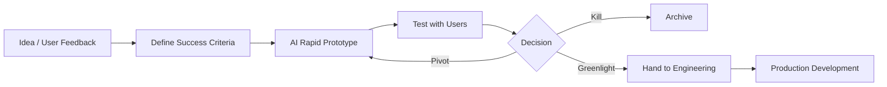

## The Timeline Collapse: Why This Matters Now

A decade ago, turning a product idea into a clickable prototype took weeks. Designers would sketch concepts, create wireframes, gather feedback, iterate, build high-fidelity mockups in Figma, hand off to developers, and hope they built the right thing. If you discovered major UX issues at that point? You'd restart.

Today? AI collapses that timeline from weeks to hours.

You can now describe a feature, generate interactive prototypes, test assumptions with users, iterate based on feedback, and deliver production-ready code—all within a single workday. This shift fundamentally changes how product teams validate ideas. Instead of relying on lengthy spec documents and abstract discussions, you can show working prototypes and get concrete feedback.

For product managers, this is a superpower. You move faster than your competitors. You derisk product decisions by testing with real users earlier. You can explore more options without burning weeks of design and engineering capacity.

**Why this matters for PMs:** The ability to prototype fast compounds your leverage. You're no longer bottlenecked by design queues or developer bandwidth. You can run 3–4 design sprints in the time a traditional team runs one.

---

## The AI Prototyping Landscape (2025–2026)

The market has crystallised around a small number of dominant players, each with distinct strengths. Understanding which tool fits which problem is critical.

### The Major Categories

**Full-Stack Application Builders**
These generate complete, deployable applications from natural language. You describe what you want—including backend logic, databases, and authentication—and they generate working code.

**Frontend Component Generators**
These specialise in UI creation from text and images. They're fast for visual iteration but typically produce only frontend code.

**AI-Assisted Design Tools**
These sit within traditional design workflows (like Figma) and speed up mockup creation and copy generation.

**Image-to-Code Converters**
Take screenshots or mockups and convert them to functional code.

### Market-Leading Platforms

#### **Bolt.new** (StackBlitz)
**Category:** Full-stack application builder (browser-based IDE)

Bolt is the speed champion. You input a text description or upload a screenshot, and it generates a complete, running application directly in your browser. No local setup required. The interface shows code side-by-side with a live preview, meaning you see changes instantly. Its key strength is blazing-fast generation (minutes, not hours), intuitive UI, and ability to convert screenshots into functional apps—perfect for quick MVPs and proof-of-concepts. The tradeoff: generated code can be brittle and require cleanup, and it works best for greenfield projects rather than integrating into existing codebases, with limited control over architecture decisions.

**Best for:** Quick prototypes, screenshot-to-app conversions, and non-technical stakeholders wanting to see ideas materialised fast.

#### **Lovable** (formerly GPT Engineer)
**Category:** Full-stack application builder (browser-based)

Lovable — which rebranded from GPT Engineer in late 2024 — emphasises full-stack generation with built-in hosting. You describe your app in natural language, and it generates UI, backend, database schema, authentication, and deployment infrastructure—all from one browser tab. Its core advantage is comprehensive full-stack generation with integrated deployment and hosting, plus an ability to turn vague ideas into working prototypes. The tradeoff: it offers less control over code architecture than Bolt, slightly slower initial generation (though still fast by traditional standards), and deployment can be slower for large projects.

**Best for:** Non-technical product managers wanting end-to-end app generation, rapid MVP validation, and teams wanting working deployed apps without infrastructure setup.

#### **v0 by Vercel**
**Category:** Frontend component generator

v0 is React-focused and excels at generating UI components. Unique among the major platforms: it can take images as input (your Figma designs, sketches, even napkin drawings) and convert them to React code, making it exceptional for design-heavy teams. Its key strength is unmatched image-to-code capability combined with clean, reusable React code with Tailwind CSS and seamless integration with the Next.js and Vercel ecosystem, making it excellent for component libraries and design systems. The limitation: it's frontend-only with no backend, database, or server logic, requires React/Next.js knowledge to extend, and isn't suitable for full-app prototyping alone.

**Best for:** Design-first teams, teams using React/Next.js, companies wanting production-ready component code, and design system maintenance.

#### **Claude Artifacts**
**Category:** Code snippet and prototype generator (within chat)

Claude is an AI assistant that can generate code directly in your conversation via "Artifacts"—interactive code blocks that live alongside your chat. You describe what you want, Claude writes it, and you can run, test, and iterate on it immediately without leaving the chat. Its key strength is seamless integration into your daily workflow without context switching, excellent reasoning about architecture and tradeoffs, the ability to build AI-powered applications using Claude's own API, and no deployment friction since code runs directly in the browser. The tradeoff: code is ephemeral and lives only in your chat (hard to share or version control), there's no hosting or database integration, and it requires comfort with code.

**Best for:** Technical PMs, exploring ideas with AI reasoning, prototyping AI-powered features, and rapid iteration within a conversation.

#### **Replit Agent**
**Category:** Full-stack development agent (browser-based IDE)

Replit Agent is an autonomous agent that can build, test, and fix code on its own. You describe a feature or app, and Agent works independently for up to 200 minutes, generating code, testing it in an integrated browser, and fixing bugs automatically. Its main advantage is autonomous operation without requiring constant iteration, integrated browser testing and bug fixing, full-stack support, and cloud-based deployment with no local setup. The limitation: it offers less interactive iteration compared to Bolt or Lovable, requires clearer upfront specifications, and is less effective at design-heavy work.

**Best for:** Teams wanting autonomous development, backend-heavy prototypes, and developers who prefer automation over interactive iteration.

#### **Figma AI & Design Tools**
**Category:** AI-assisted design plugin ecosystem

Figma has integrated AI capabilities directly into its design tool, including prototype generation (describe screens and get design mockups), copy generation (tools like Frontitude provide UX copy suggestions), and layout assistance (AI helps structure designs according to best practices). Its main advantage is seamless integration into existing design workflows with no context switching, and teams already using Figma can start immediately with good visual consistency. The limitation: it generates mockups rather than code (requiring a handoff to development) and is less comprehensive than dedicated prototyping platforms.

**Best for:** Design teams using Figma, teams wanting to stay in their existing design workflow, and mockup-heavy work.

---

## Platform Comparison Matrix

| **Platform** | **Speed** | **Full-Stack?** | **Code Quality** | **Deployment** | **Learning Curve** | **Best For** |
|---|---|---|---|---|---|---|
| **Bolt.new** | Very Fast | Yes | Good | Manual | Very Low | Quick MVPs, screenshots-to-app |
| **Lovable** | Fast | Yes | Good | Built-in | Very Low | Full-stack rapid prototypes, hosting included |
| **v0** | Very Fast | Frontend only | Excellent | Vercel | Low | React/design-heavy projects |
| **Claude Artifacts** | Fast | Yes | Excellent | None (ephemeral) | Medium | AI features, exploration, technical iteration |
| **Replit Agent** | Moderate | Yes | Good | Manual | Medium | Autonomous development, backend work |
| **Figma AI** | Fast | Mockups only | N/A | Manual handoff | Low | Design mockups, visual iteration |

---

## When to Use AI Prototyping (And When Not To)

AI prototyping is powerful, but it's not a replacement for traditional methods in all scenarios. Understanding the tradeoffs is critical.

### **Use AI Prototyping When:**

**Validating ideas and exploring options.** When you have an idea but aren't certain it solves the problem, build a quick prototype in 2–3 hours, show users, and iterate—at a fraction of traditional development cost. Similarly, instead of committing to one design direction, AI makes it feasible to generate and test 3–4 different approaches in parallel, with each variant taking hours instead of weeks.

**You need working code or technical prototypes fast.** For backend features, complex logic, or full-stack functionality, AI generates working, testable code faster than traditional development, especially for CRUD features and standard patterns. This is particularly valuable for time-sensitive decisions—when you have 48 hours to validate a hypothesis before pitching investors or making a major pivot, AI's timeline compression becomes a genuine competitive advantage.

**Non-designers need to express ideas or you're building AI-powered features.** A product manager, marketer, or founder can communicate a vision without requiring design resources. If you're building AI-powered functionality, Claude Artifacts or similar tools let you prototype the feature and the AI integration simultaneously.

### **Avoid AI Prototyping When:**

**Design and brand sophistication matter.** If brand consistency is paramount or your product lives or dies on beautiful UI, AI tools often generate generic, template-heavy designs. You're better off with a designer iterating within your system (though v0 can be trained on design components). Similarly, if your app requires deeply considered information architecture—like complex dashboards, multi-step flows, or intricate permission structures—start with a designer and use AI to accelerate implementation, not lead the strategy.

**You're integrating with legacy systems or have strict technical constraints.** AI excels at greenfield code. If you're integrating into complex, undocumented legacy systems, legacy APIs, or have tight architectural requirements, AI will struggle. The same applies if your success depends on specific engineering patterns (GraphQL, event-driven architecture, particular libraries)—AI might generate REST endpoints when you need GraphQL, and you'll spend more time rewriting than coding from scratch.

**Accessibility, compliance, or performance is complex.** AI generates accessible HTML by default, but nuanced patterns (complex forms, live regions, custom widgets) benefit from human expertise. If you're building a medical device, financial software, or highly regulated product, AI can help with the presentation layer, but domain-specific logic and validation require expert oversight. Similarly, AI generates working code, not optimised code—if you're building something with strict performance requirements, you'll need engineers to optimise before production.

---

## Step-by-Step: Building a Customer Dashboard Prototype with v0

Let's walk through a realistic example: **a product manager wants to validate a customer analytics dashboard feature before committing engineering resources.**

### The Scenario

Your SaaS product serves marketing teams. You want to add a dashboard showing customer engagement metrics: active users, feature adoption, usage trends. You have rough wireframes in Figma and want a functional prototype to test with 5 customers before greenlit it.

Timeline: 4 hours (vs 2–3 weeks traditionally).

### Step 1: Prepare Your Input (15 minutes)

Gather materials:
- Screenshot of your Figma wireframe (or sketch)
- Clear description of the data you'd show
- List of metrics to display
- Specific color palette or brand guidelines (optional)

**Your prompt to v0:**
```
I'm designing an analytics dashboard for a SaaS product management tool.
The dashboard should show:
- Active users (metric card showing number + 30-day trend)
- Feature adoption rate (percentage + line chart showing adoption over time)
- Top features by usage (table showing feature name, user count, % of active users)
- Usage timeline (line chart showing total events per day over last 30 days)

Use a clean, professional design. Color scheme: primary blue (#0066cc), dark text, light gray backgrounds.
The dashboard should be responsive and work on tablets.
Here's my Figma wireframe [ATTACH IMAGE].
```

### Step 2: Generate Initial Prototype (5 minutes)

v0 processes your input and generates a React component. You see a live preview alongside the code. This includes:
- Responsive layout
- Interactive charts (using a library like Recharts)
- Metric cards
- Navigation structure

**This is production-adjacent code you can actually use.**

### Step 3: Refine and Iterate (30 minutes)

Your preview shows the dashboard. You notice:
- The line chart is hard to read with overlapping lines
- The "Top Features" table needs better sorting
- The color of the adoption rate card should match your brand blue more closely

You request changes via chat:
```
Make the adoption rate card background #0066cc with white text.
On the line chart, add a legend and make the lines thicker.
Let users sort the "Top Features" table by clicking column headers.
```

v0 regenerates the code within seconds. You see changes in the live preview immediately.

### Step 4: Add Real Data (30 minutes)

The prototype currently shows hardcoded sample data. You want to connect it to your API so you can test with real data.

You export the component and:
- Replace the hardcoded data array with an API fetch
- Add loading and error states
- Connect it to your authentication system

**Because v0 generates clean, readable React, this is straightforward.** Even if a developer helps here, it's 30 minutes of work, not 3 days.

### Step 5: Test with Users (1 hour)

You deploy the dashboard to a staging environment or share a Vercel preview link. Your 5 target customers test it in their environment.

**Feedback you collect:**
- The metric order should be different
- They want to export data as CSV
- The timeframe should be customisable (7 days, 30 days, 90 days)

### Step 6: Iterate (1 hour)

Rather than brief a designer and developer, you go straight to v0 with the feedback. Each requested change takes 10–15 minutes to regenerate and test.

### Step 7: Hand Off or Build (2 hours)

Once validated, you have two options:

**Option A: Hand the code to engineering**
The code is clean React, so a developer can extend it, integrate it properly, add backend endpoints, handle authentication, and ship it. Typically 3–5 days instead of 2–3 weeks.

**Option B: Deploy it directly**
If the feature is simpler than expected and doesn't require complex backend integration, you might deploy the prototype nearly as-is (with some polish).

### Why This Works

- **Fast feedback loops:** You iterate in hours, not days
- **Concrete validation:** Users interact with a working prototype, not a wireframe
- **Reduced miscommunication:** No gap between what you imagined and what was built
- **Lower risk:** You're validating demand before committing weeks of engineering

---

## The Practical Workflow: Integrating AI Prototyping Into Your Process

Most teams don't use AI prototyping alone. Instead, they fold it into existing workflows:



**The loop from idea to validated learning takes 1 week instead of 4.**

### For Product Managers

1. **Use AI to explore multiple options:** When faced with an ambiguous problem, generate 2–3 different prototype directions in parallel.
2. **Validate assumptions fast:** Don't wait for design and engineering estimates. Generate a quick prototype and test your hypothesis.
3. **Communicate more clearly:** A working prototype is 10x clearer than a 10-page requirements document.
4. **Compress design sprints:** Run a 1-week design sprint with AI. Generate prototypes, test, iterate, decide all in 5 days.

### For Design Teams

1. **Use AI for exploration, not execution:** Generate quick wireframe variations, then a designer refines the winning direction.
2. **Accelerate iteration:** Rather than redoing mockups by hand, iterate faster with AI, then hand off clean designs to engineering.
3. **Stay in your design system:** Use v0 trained on your component library to keep generated UI consistent.

### For Engineering Teams

1. **Reduce handoff friction:** Prototypes come with working code, reducing the "what did they actually want?" ambiguity.
2. **Focus on architecture, not boilerplate:** AI handles standard CRUD UIs and components. Engineers focus on complex logic, integration, and scalability.
3. **Validate before committing:** Engineering can generate quick prototypes to validate architectural decisions before committing to a direction.

---

## What AI Prototyping Can't Do Well (The Honest Limits)

AI is powerful, but it's not magic. Knowing its limits prevents wasted effort and unmet expectations.

**Design and visual sophistication.** AI generates functional, usable UI, but not delightful, beautiful, distinctive design. It's good at straightforward layouts (dashboards, lists, forms, feeds) but struggles with deeply considered information architecture where the structure itself is the core innovation. If your product's value proposition includes premium design or novel navigation patterns, you need designers. Use AI for rapid iteration on flows and functionality, then hand the winning direction to a designer for polish and to ensure visual consistency with your brand system.

**Technical constraints and integrations.** AI generates working code, not optimised code. If you're building something with strict performance requirements (real-time data, animations, heavy computation), AI-generated code might need significant optimisation by engineers. Similarly, AI excels at greenfield development but struggles with complex legacy systems or undocumented APIs. If you're integrating with a complex legacy architecture, start with simplified API mocks to establish patterns, then have engineers integrate with the real system.

**Domain-specific decisions and accessibility nuance.** If you're building a medical device, financial software, or highly regulated product, AI can help with the presentation layer but can't make domain-specific decisions that require expertise. Accessibility is similar: AI generates accessible HTML for standard patterns, but non-standard interactions (complex widgets, custom forms) sometimes miss accessibility edge cases. Involve accessibility experts and domain experts where their knowledge is critical. Multi-stakeholder alignment also can't be automated—if your team has different mental models of what you're building, a prototype alone won't force that conversation. Align on requirements before prototyping and use the prototype to validate, not discover, intent.

---

## Evaluating AI Prototyping Tools: A Decision Framework

**Choosing the right tool depends on your answer to these questions:**

1. **Do I need a full-stack app (backend + database + hosting)?**
   - Yes → Lovable or Replit Agent
   - No, just frontend UI → v0 or Bolt

2. **How important is code quality and reusability?**
   - Very important → v0 (clean React) or Claude Artifacts (with review)
   - Important but not critical → Bolt or Lovable

3. **Do I have design mockups or Figma designs to convert?**
   - Yes → v0 (exceptional at image-to-code)
   - No → Lovable or Bolt (work from text description)

4. **What's my team's technical sophistication?**
   - Non-technical → Lovable (most approachable)
   - Somewhat technical → Bolt (intuitive UI)
   - Technical → Claude Artifacts or Replit Agent (more control)

5. **How much iteration will I do before handoff?**
   - Lots (5+ rounds) → Bolt or v0 (best interactive experience)
   - Moderate (2–3 rounds) → Lovable
   - Minimal → Replit Agent (generates more autonomously)

---

## Key Takeaways

- **Timeline compression is real:** AI prototyping collapses weeks into hours, changing how fast teams can validate ideas.

- **Different tools, different strengths:** No single tool is best for everything. v0 owns image-to-code and React components. Lovable is unbeatable for full-stack rapid apps. Bolt excels at speed. Claude Artifacts integrate into daily workflow.

- **Prototyping is hypothesis testing, not final design:** Use AI to validate assumptions quickly, not to replace designers and engineers.

- **Integration matters more than any single tool:** The best teams fold AI prototyping into their existing workflows, using it to compress timelines without disrupting process.

- **Know the limits:** AI isn't good at brand differentiation, complex IA, or domain-specific decisions. Use it where it excels (UI generation, rapid iteration, boilerplate reduction) and pair it with human expertise elsewhere.

- **Speed creates advantage:** The ability to test 3 product directions instead of 1 before committing resources is a genuine competitive advantage.

---

## Explore Further

- Prompt Engineering – Learn to write better prompts for all your AI prototyping tools
- AI-Powered Mindset – Understand how to think about AI as a PM
- Identify Opportunities for AI – Spot where AI prototyping creates the most value in your product workflow

### Resources & Links

- [v0 Documentation](https://v0.dev) – Official v0 by Vercel docs
- [Bolt.new](https://bolt.new) – AI full-stack builder
- [Lovable](https://lovable.dev) – Full-stack app generator
- [Claude Artifacts Tutorial](https://support.claude.com/en/articles/11649438-prototype-ai-powered-apps-with-claude-artifacts) – Official guide to building with artifacts
- [Replit Agent Overview](https://replit.com) – Autonomous AI coding agent
- [Frontitude](https://write.frontitude.com) – AI UX writing tool for Figma
- [Complete Comparison: v0 vs Bolt vs Lovable](https://www.nxcode.io/resources/news/v0-vs-bolt-vs-lovable-ai-app-builder-comparison-2025) – Detailed platform comparison
