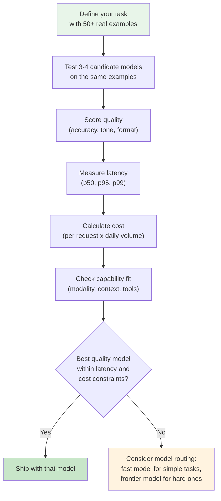
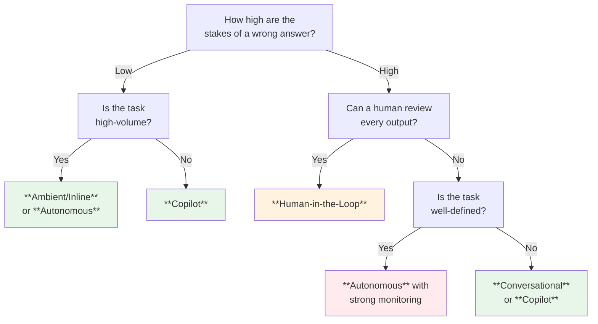
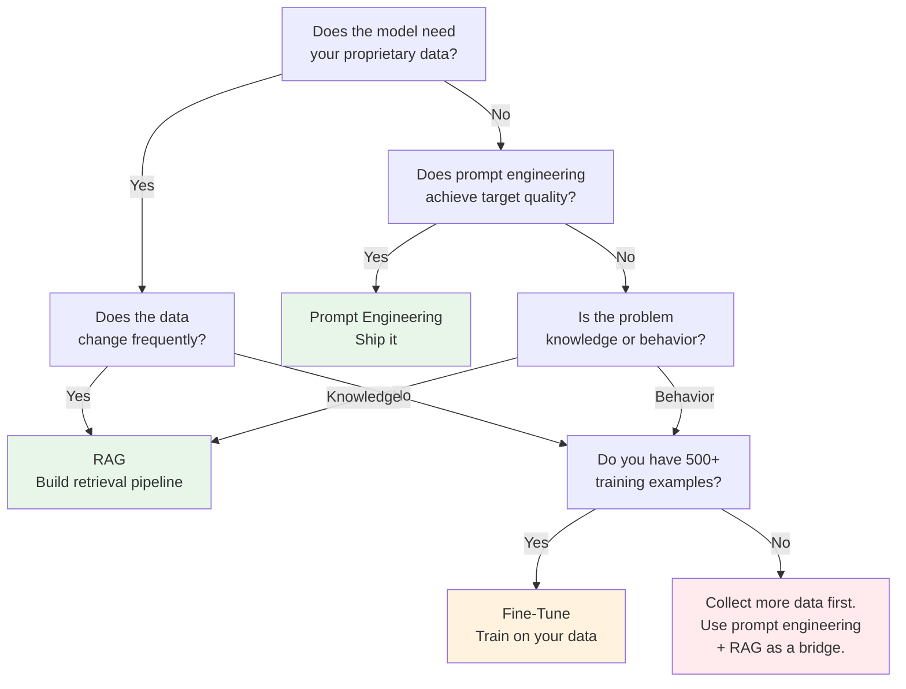

Consider a scenario that plays out regularly across the industry: a well-funded fintech startup launches an AI feature that auto-categorizes expenses for small business owners. The model is accurate, the UX is slick, and the launch blog post goes viral. Within six weeks, they quietly roll it back. The problem isn't the AI — it's the design decisions around it. No fallback when the model is uncertain. No way for users to correct miscategorizations. No monitoring to catch the drift that creeps in as tax season brings unusual expense patterns the model has never seen.

You've found an opportunity. You've validated it's viable. Now comes the part where most AI features quietly die: the design decisions between "great idea" and "shipped product."

This module covers the four design decisions that separate successful AI features from cautionary tales: choosing the right model, designing for inevitable failures, picking the right interaction pattern, and deciding how to give the model the knowledge it needs.

---

## Part 1: Evaluating Different Models

### The Landscape (Without the Hype)

The model market moves fast. New releases land monthly, benchmarks shift, and pricing changes overnight. Rather than give you a comparison table that will be outdated by next quarter, this section teaches you *how to evaluate* — a skill that stays relevant regardless of which models exist.

As of this writing, the major model families include OpenAI's GPT series, Anthropic's Claude series, Google's Gemini series, Meta's Llama (open-source), and Mistral (open-source). But the specific models matter less than knowing what questions to ask.

### The Five Dimensions That Matter

When evaluating models for a product feature, assess these dimensions in order of importance for your use case:

**1. Quality on YOUR task** — Not benchmark quality. YOUR task quality. MMLU, HumanEval, and other benchmarks tell you how a model performs on standardized academic tests. They correlate loosely with real-world performance, but a model that scores 2% higher on MMLU may perform worse on your specific customer support classification task. Always run your own evaluation with real examples from your product.

**2. Latency** — How fast does the response arrive? This varies dramatically. A frontier model might take 3-8 seconds for a complex response; a smaller model might return in under 500ms. For inline suggestions (like smart compose), anything above 200ms feels sluggish. For a background summarization job, 10 seconds is fine.

**3. Cost per token** — Model pricing follows a pattern: larger, more capable models cost more per input and output token. The gap can be 10-50x between a frontier model and a small one. For a feature that processes thousands of requests daily, this difference is the difference between a viable product and a cost center.

**4. Context window** — How much text can you send the model at once? Ranges from 4K tokens (some older models) to 200K+ tokens (Claude, Gemini). If your feature needs to process a 50-page document, a small context window is a dealbreaker — or forces you into chunking strategies that add complexity.

**5. Capabilities** — Does it handle images? Audio? Function calling? Structured JSON output? Not all models support all modalities. If your feature requires analyzing screenshots, you need a multimodal model.

### The Evaluation Framework

**Key insight: Model routing.** You don't have to pick one model. Many production AI features use a lightweight model (fast, cheap) for 80% of requests and escalate complex cases to a frontier model. Think of it like a triage nurse before a specialist: most questions don't need the specialist.

### Open Source vs. Closed Source

This decision maps to the engagement spectrum from the Assessing AI Viability module.

**Closed-source models** (GPT-4o, Claude, Gemini) offer higher capability, managed infrastructure, and rapid improvement — but you're dependent on a vendor's pricing, uptime, and policy changes.

**Open-source models** (Llama, Mistral, Qwen) give you full control: host them yourself, fine-tune freely, no per-token costs beyond compute. The tradeoff is operational complexity and generally lower capability on the hardest tasks.

**The PM decision**: If your feature is strategic and cost-sensitive at scale, open-source deserves serious evaluation. If you need to ship fast and the feature isn't on a cost-critical path, closed-source models let you move faster.

---

## Part 2: Designing for Failure Cases

This is the section that separates AI features that users trust from AI features that users abandon.

### Accept This First: AI Will Fail

Not might. *Will*. Every LLM hallucinates. Every classifier has false positives. Every extraction model misses edge cases. The question isn't "will it fail?" — it's "what happens when it does?"

Recall from the LLMs module that LLMs are probabilistic, not deterministic. They generate the most likely next token, not the "correct" answer. This architectural reality means failure is built into the system. Your job is to make failure graceful.

### The Failure Design Framework

For every AI feature, answer these four questions before writing a single line of code:

**1. What does failure look like?**

Map the specific failure modes for your feature. For an AI that summarizes customer support tickets:
- **Hallucination**: Invents details that weren't in the ticket ("customer mentioned they're cancelling" when they didn't)
- **Omission**: Misses the key issue and summarizes the small talk
- **Misclassification**: Tags a billing issue as a feature request
- **Tone mismatch**: Produces a casual summary for an escalated legal complaint

**2. What's the blast radius of each failure?**

Not all failures are equal. A misclassified ticket that gets routed to the wrong queue adds 10 minutes of delay. A hallucinated claim that the customer threatened legal action could trigger an unnecessary legal review. Score each failure mode by frequency x severity.

**3. What's the fallback path?**

For every AI-powered flow, design the non-AI path. If the model is down, slow, or producing garbage, what happens? Options include:
- **Graceful degradation**: Show the original content without the AI summary
- **Human escalation**: Route to a person when confidence is low
- **Cached response**: Show the last good output until quality recovers
- **Transparent failure**: "I wasn't able to summarize this ticket. Here's the original."

The worst outcome is silent failure — the AI produces a confidently wrong answer and nobody notices.

**4. How will you detect failure in production?**

You need monitoring. Specifically:
- **Confidence scoring**: If your model outputs confidence scores, set thresholds. Below 0.7? Flag for human review.
- **Output validation**: Does the summary mention entities that exist in the original ticket? Does the classification match one of the valid categories?
- **User feedback loops**: Add thumbs up/down, "this is wrong" buttons, or edit tracking. If users edit 40% of AI suggestions, your feature has a quality problem.
- **Drift detection**: Model performance degrades over time as your data distribution shifts. Monitor weekly accuracy, not just launch-day accuracy.

### Worked Example: AI Ticket Router

Let's trace through the framework for a feature that automatically routes incoming support tickets to the right team.

| Failure Mode | Frequency | Severity | Blast Radius | Mitigation |
|---|---|---|---|---|
| Wrong team assignment | ~10% of tickets | Medium — adds 15 min delay | Customer waits longer | Show routing suggestion to agent; agent confirms or overrides |
| Unrecognized ticket type | ~3% of tickets | Low — falls to general queue | Slight delay | Default to general queue with "needs triage" flag |
| Model downtime | ~0.1% of time | High — all routing stops | All tickets unrouted | Automatic fallback to keyword-based rules engine |
| Confident wrong answer | ~2% of tickets | High — agent trusts AI, doesn't verify | Wrong resolution sent | Display confidence score; flag low-confidence predictions visibly |

The design decision: this feature launches as **human-in-the-loop** (AI suggests, agent confirms) for the first month. After accuracy exceeds 95% on 1,000+ tickets, graduate to **autonomous with monitoring** (AI routes, agents can override, weekly accuracy audit).

---

## Part 3: Design Patterns for AI Features

Not every AI feature should be a chatbot. The interaction pattern you choose determines how users experience your AI, how much trust they need to extend, and how much damage a failure can cause.

### Pattern 1: Copilot (AI Assists, Human Decides)

The AI generates suggestions; the human accepts, edits, or rejects. The human remains in control at every step.

**Examples**: GitHub Copilot (code suggestions), Gmail Smart Compose (sentence completions), Notion AI (draft text that you edit).

**When to use**:
- The task requires human judgment or creativity
- Errors are easy for the user to catch and correct
- Users are skilled in the domain (they know good output from bad)

**Risk level**: Low. The human is the safety net.

### Pattern 2: Autonomous Agent (AI Acts, Human Monitors)

The AI takes action independently. Humans review outcomes after the fact, not before.

**Examples**: Automated ticket routing, spam filters, fraud detection systems, dynamic pricing engines.

**When to use**:
- High volume makes human review impractical
- The task is well-defined with clear success criteria
- You have robust monitoring and rollback capability
- False positives/negatives have manageable consequences

**Risk level**: Medium to high. Requires strong monitoring and fallback systems.

### Pattern 3: Human-in-the-Loop (AI Suggests, Human Approves)

The AI does the work but pauses for human approval before any action takes effect. A middle ground between copilot and autonomous.

**Examples**: Content moderation queues (AI flags, human decides), AI-drafted customer emails (agent reviews before sending), medical image analysis (AI highlights, radiologist confirms).

**When to use**:
- Errors have significant consequences
- Volume is manageable for human review
- Regulatory or compliance requirements demand human oversight
- You're building trust in a new AI feature before graduating to autonomous

**Risk level**: Low to medium. The approval step catches most errors.

### Pattern 4: Conversational Interface (Chat)

The user interacts through natural language dialogue. The AI interprets intent, asks clarifying questions, and provides responses.

**Examples**: Customer support chatbots, Siri/Alexa, ChatGPT-style interfaces embedded in products.

**When to use**:
- The task is exploratory or open-ended
- Users have varying needs that can't be predicted with a fixed UI
- The interaction benefits from back-and-forth refinement

**Risk level**: Medium. Users may over-trust conversational AI or become frustrated when it misunderstands.

### Pattern 5: Ambient/Inline AI (Contextual Suggestions)

AI surfaces information or suggestions proactively, without the user explicitly asking. It appears in the flow of work, not as a separate interface.

**Examples**: Gmail's Smart Reply (suggested quick responses), Spotify Discover Weekly (personalized recommendations), IDE error detection with fix suggestions.

**When to use**:
- The suggestion is low-stakes and easy to ignore
- The AI can infer context from the user's current activity
- Minimal friction is essential (the feature should help, never interrupt)

**Risk level**: Low, if users can easily dismiss suggestions. High if suggestions auto-apply.

### Choosing Your Pattern

**Most AI features should start as Copilot or Human-in-the-Loop** and graduate to more autonomous patterns as you build confidence through data. Launching as fully autonomous is almost always premature unless you have extensive offline evaluation data.

---

## Part 4: Fine-Tune vs. Prompt Engineer vs. RAG

You've chosen your model, designed for failure, and picked your interaction pattern. The last design decision: how does the model get the knowledge and behavior it needs?

This connects directly to the foundations in the Context Engineering module. Here, we focus on the PM's decision framework.

### Option 1: Prompt Engineering

**What it is**: Crafting instructions, examples, and constraints in the prompt itself. No model modification. No infrastructure beyond an API call.

**When it works**:
- The task is well-defined and can be described in natural language
- You have a clear output format you can specify
- The model's general knowledge is sufficient (you don't need proprietary data)
- You want to ship this week, not this quarter

**When it doesn't**:
- The model consistently ignores your instructions on tone or format
- Your task requires knowledge the model doesn't have (your product's features, internal terminology)
- Prompt length is eating into your context window and cost budget

**Cost**: Essentially free beyond API usage. Changes deploy instantly.

**PM rule of thumb**: Always start here. You'd be surprised how far a well-crafted system prompt with 3-5 examples gets you. Reference the Prompt Engineering module for the practical techniques.

### Option 2: RAG (Retrieval-Augmented Generation)

**What it is**: At query time, retrieve relevant documents from your data and inject them into the prompt. The model uses this context to answer. Covered in depth in the Context Engineering module.

**When it works**:
- The model needs access to your proprietary data (product docs, knowledge base, customer records)
- That data changes frequently (you don't want to retrain every time the docs update)
- Accuracy on factual questions about your domain is critical
- You want the model to cite its sources

**When it doesn't**:
- Your data is unstructured, poorly organized, or contradictory
- The task is about behavior (how the model responds) rather than knowledge (what it knows)
- Retrieval quality is poor — the system pulls irrelevant documents, and the model generates answers from the wrong context

**Cost**: Moderate. You need a vector database, an embedding model, a retrieval pipeline, and ongoing data ingestion. Expect 2-4 weeks of engineering for a basic setup.

**PM rule of thumb**: Use RAG when the model needs to know things it wasn't trained on. Don't use RAG to fix behavior problems — that's a prompt engineering or fine-tuning issue.

### Option 3: Fine-Tuning

**What it is**: Training the model on your data so it learns new behaviors, formats, or domain expertise. The model's weights are modified.

**When it works**:
- You need consistent behavior that prompt engineering can't reliably produce (specific tone of voice, output format, domain terminology)
- You have hundreds to thousands of high-quality input-output examples
- Latency matters and you want a smaller, faster model that performs like a bigger one on your specific task
- Cost at scale justifies the upfront investment (a fine-tuned small model is often cheaper per request than prompting a frontier model)

**When it doesn't**:
- You don't have enough training data (minimum ~100 examples, ideally 500+)
- Your requirements change frequently (each change requires retraining)
- The base model already performs well with good prompting

**Cost**: High upfront. Training runs, data preparation, evaluation, ongoing maintenance as data drifts. Expect weeks to months for a production-quality fine-tune.

**PM rule of thumb**: Fine-tuning is your last resort, not your first. Most teams that think they need fine-tuning actually need better prompts or RAG. Reserve fine-tuning for when you have clear evidence that the other approaches fall short.

### The Decision Tree

### They're Not Mutually Exclusive

In production, many AI features layer these approaches. Consider a customer support Q&A bot:

- **Fine-tuning** teaches a smaller model your company's tone and response format (saving cost vs. a frontier model)
- **RAG** retrieves the latest help articles and release notes at query time (so answers stay current without retraining)
- **Prompt engineering** controls each interaction — system prompts define the persona, few-shot examples handle edge cases, and format constraints ensure the output is structured for your chat widget

These are layers, not alternatives. Start with prompt engineering alone. Add RAG when the model needs your data. Add fine-tuning only when the first two approaches plateau on quality.

---

## Key Takeaways

- **Benchmark on your task, not leaderboards.** Model rankings change monthly; your use case doesn't. Test 3-4 candidates on 50+ real examples before committing.
- **Design for failure first.** Map every failure mode, its blast radius, and the fallback path before you build. Silent failure is the worst outcome.
- **Start with Copilot, graduate to autonomous.** Most AI features should launch with human oversight and earn trust through data before running independently.
- **Prompt first, RAG second, fine-tune last.** This ordering minimizes cost, complexity, and time-to-ship. Only escalate when you have evidence the simpler approach falls short.
- **Model routing saves money.** Use a cheap, fast model for easy requests and a frontier model for hard ones. You don't have to pick just one.

---

## Explore Further

- **Anthropic's Model Selection Guide** — Practical guidance on choosing between Claude model sizes for different use cases: https://docs.anthropic.com
- **Google's People + AI Guidebook** — Comprehensive design patterns for AI features with UX research backing: https://pair.withgoogle.com/guidebook
- **Hugging Face Open LLM Leaderboard** — Live benchmarks for open-source models, useful for tracking the landscape: https://huggingface.co/spaces/open-llm-leaderboard/open_llm_leaderboard
